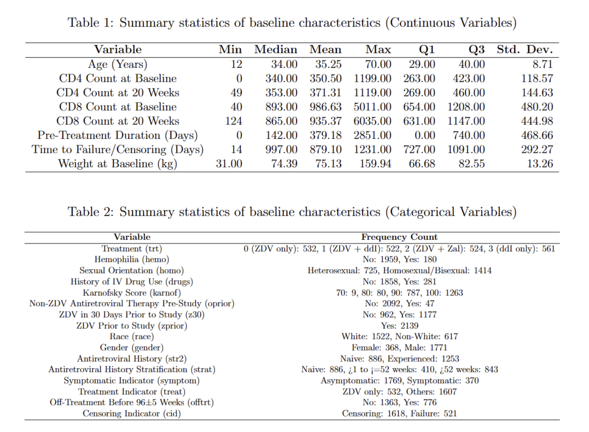
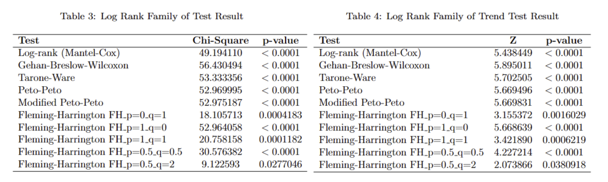
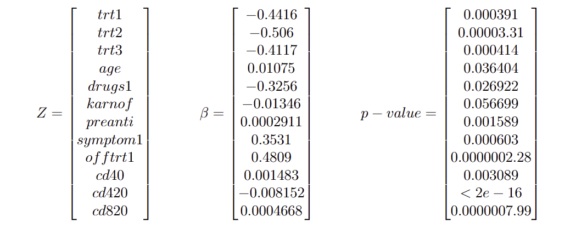

\ \par
# Introduction

Acquired Immunodeficiency Syndrome (AIDS) poses a persistent and formidable global health challenge, affecting millions worldwide with the human immunodeficiency virus (HIV). The quest for effective treatment strategies is paramount, not only to ameliorate patients' quality of life but also to prolong their survival . In this context, our investigation is centered on harnessing insights from the AIDS Clinical Trials Group (ACTG) Study 175 dataset  . This dataset, arising from a randomized, double-blind, placebo-controlled trial, meticulously compares various treatment modalities. Specifically, it juxtaposes monotherapy with zidovudine or didanosine against combination therapies involving zidovudine, didanosine, and zalcitabine. The study cohort comprises adults infected with HIV-1, exhibiting CD4 cell counts between 200 and 500 per cubic millimeter. The primary study endpoints, including a substantial decline in CD4 cell count, progression to AIDS, or death, provide a comprehensive basis for our survival analysis. Employing life tables, Kaplan-Meier survival curves, log-rank tests, and the Cox proportional hazards model , our analytical approach aims to unravel the intricate web of factors influencing survival outcomes in AIDS patients. Through meticulous data processing and exploratory data analysis (EDA), we endeavor to not only describe survival trends over time intervals but also to rigorously evaluate the efficacy of distinct treatment regimens. Thus, our commitment extends to integrating advanced statistical techniques, ensuring a nuanced and comprehensive understanding of the dataset's implications. This research, therefore, stands poised to contribute substantively to the ongoing pursuit of effective interventions in the realm of AIDS treatment.

# Data Description

## Data Summary

This part analyzed the baseline characteristics of participants enrolled in the AIDS Clinical Trials Group Study 175. The dataset comprises a diverse range of variables, categorized into continuous and categorical types, each offering insights into the participant profiles and study conditions. See Table 1 and Table 2.

The continuous variables include age, CD4 and CD8 counts at baseline and 20 weeks, duration of pre-treatment antiretroviral therapy, time to failure or censoring, and weight at baseline. Participants ranged in age from 12 to 70 years, with a median age of 34 years. The median CD4 count at baseline was 340, increasing slightly to 353 at 20 weeks. Similarly, CD8 counts showed an increase from a median of 893 at baseline to 865 at 20 weeks. The participants had a varied duration of pre-treatment with antiretroviral therapy, ranging from 0 to 2851 days. The median time to failure or censoring was observed at 997 days. Weight varied widely among participants, with a median of 74.39 kg.

The categorical variables offer insights into treatment types, hemophilia status, sexual orientation, history of IV drug use, Karnofsky score, prior antiretroviral therapy, race, gender, symptomatic indicators, and treatment indicators. Treatment types were evenly distributed among the four categories. A majority of participants did not have hemophilia (1959 out of 2139), were engaged in homosexual/bisexual activities (1414 out of 2139), and had no history of IV drug use (1858 out of 2139). Most participants had a high Karnofsky score of 100. The majority were also not on non-ZDV antiretroviral therapy pre-study and had used ZDV prior to the study. The study population was predominantly male (1771 out of 2139) and white (1522 out of 2139). Regarding antiretroviral history, a significant proportion were experienced in antiretroviral therapy. The majority of participants were asymptomatic, and a large number were on treatments other than ZDV only. The off-treatment indicator before 96±5 weeks showed a larger number not going off treatment, and censoring was more common than failure in the outcome variable.

# Result

## Exploratory Data Analysis Findings

In the exploratory data analysis of the clinical study, a thorough examination of continuous and categorical variables was conducted to assess the comparability of treatment groups within a randomized controlled trial (RCT) framework.  The heatmap analysis, comprising scatter plots, histograms, and correlation coefficients, revealed a successful randomization process, indicated by the similar distribution shapes and spreads of continuous covariates like age, CD4 and CD8 counts, weight, and pre-treatment duration across four treatment regimens.  This uniformity ensures each group's comparability at baseline, crucial for evaluating treatment efficacy and safety.  While the CD4 and CD8 counts, key markers in HIV treatment, showed a significant increase across treatments, suggesting effective immune restoration, the analysis also revealed a notable exception in multicollinearity, primarily between CD4 and CD8 counts.  These findings underscore the need to employ statistical techniques that address the interdependency of these counts, ensuring accurate coefficient estimation and maintaining the integrity of the analysis.

The exploration of categorical variables through bar charts further affirmed the balanced distribution of key demographics and clinical characteristics like hemophilia status, sexual orientation, and drug use history across the treatment groups, reinforcing the effectiveness of the randomization.  The boxplot visualization highlighted the relationship between various categorical variables and event time, a critical endpoint in the study.  While some variables like the Karnofsky score and treatment type showed potential influences on event timing, others exhibited less variability, indicating a minimal impact.

## Life table

The life tables stratified by the treatment groups provided each 100-day interval-specific survival information for patients receiving different AIDS treatments over time. Across all groups, they began with a survival probability of 100%. The hazard rate followed a pattern of increase until the 800 to 900-day interval, after which it showed a decline at different rates, and we need to perform further test to convince this difference. The median survival times were not attainable as the survival probability did not reach 50% within the study time for any group. Considering the 80% survival time instead, Treatment Group 0(ZDV only) showed the earliest time with 600-700 days, Treatment Group 3(ddI only) displayed intermediate time with 900-1000, and Treatment Group 1(ZDV + ddI) and 2(ZDV + Zal) showed latest time with 1000-1100 days.

## Non-parametric Survival Estimate

We utilized the Kaplan-Meier survival analysis and Nelson-Aalen Estimator with 95% confidence interval to estimate the survival probabilities for different treatment groups over time which extended up to 1250 days, displayed in Figure 1. According to the result of Kaplan-Meier survival analysis, we observed that the magnitude of the differences between the curves varies over time. Initially, the curves start close together, indicating similar survival probabilities across all groups. However, as time progresses, the curves diverge, with Treatment Group for ZDV + ddI consistently showing the highest survival probability and Treatment Group for ZDV only showing the lowest. The curves for Treatment Groups for ZDV + Zal and ddI only display intermediate survival probabilities, with Group ZDV + Zal generally above Group ddI only. The Nelson-Aalen Estimator gives the same result. The left table below is Log Rank Family of Test Result of Kaplan-Meier estimate, the table on the right sight is about Nelson-Aalen.

# Non-parametric test

## 1) Log rank family of test

A series of log-rank family tests were conducted to compare survival distributions across the four treatment groups in the study: ZDV only (0), ZDV + ddI (1), ZDV + Zal (2), and ddI only (3). Under the null hypothesis $ H_0: S_0(t) = S_1(t) = S_2(t) = S_3(t) $, where $ S_i(t) $ represents the survival function of the $ i^{th} $ treatment group at time $ t $, the tests sought to detect any differences in survival functions among the treatment groups.

As Table 3 shows, the results from the Log-rank (Mantel-Cox), Gehan-Breslow-Wilcoxon, Tarone-Ware, Peto-Peto, and Modified Peto-Peto tests all yielded highly significant $ p $-values below the 0.0001 threshold, firmly rejecting the null hypothesis at a conventional significance level of 0.05. This indicates that there are statistically significant differences in the survival functions across the treatment groups.

The Fleming-Harrington family of tests, which gives different weights to events at different times, also supported the rejection of the null hypothesis for most configurations of $ p $ and $ q $ parameters. However, for the FH test with $ p=0.5 $ and $ q=2 $, the $ p $-value was 0.0277046, which is above the more stringent significance level of 0.01 but still indicates significant differences at the 0.05 level.

## 2) Trend log rank test

A weighted log-rank family trend test was applied to assess the survival functions across four treatment groups, informed by the initial findings from Kaplan-Meier estimations. The Kaplan-Meier curves suggested a notably lower survival probability for the treatment group 0 (ZDV only) compared to the other groups, which exhibited similar survival probabilities. Consequently, we state the null hypothesis 
$$H_0: S_0(t) = S_1(t) = S_2(t) = S_3(t)$$ 
$$H_1: S_0(t) \leq S_1(t) = S_2(t) = S_3(t)$$

with weights (1,3,3,3) assigned to reflect the observed KM trends.

As Table 4 shows, the Log-rank (Mantel-Cox) test, Gehan-Breslow-Wilcoxon test, and Tarone-Ware test all indicated significant differences in survival experiences among the treatment groups, with p-values well below the $0.0000001$ threshold. The Peto-Peto and Modified Peto-Peto tests substantiated these findings with similarly significant p-values. Fleming-Harrington tests across various parameter settings revealed significant trends, notably for $FH_p=0_q=1$ (p = 0.0016029), indicating significant differences at the $0.05$ significance level. The results were consistent for other parameter configurations, with the exception of $FH_p=0.5_q=2$, which presented a p-value of 0.0380918, signifying a weaker trend that is significant at the $0.05$ level but not at the more stringent $0.01$ level.

# Cox-PH model

Based on the three different step selection directions, three models are generated. The models used backward selection and bidirection selection generated the same model, variables selected as statistically significant at the 0.05 alpha level are trt1(ZDV+ddI), trt2(ZDV+Zal), trt3(ddI), age, drugs1(history of IV drug use), karnof, preanti, symptom1, offtrt1, cd40(cd4 at baseline), cd420(CD4 at 20 +/- 5 weeks), and cd820(CD8 at 20 +/- 5 weeks). The model used forward selection selected variables that are statistically significant at the 0.05 alpha level also includes the same variables, however it includes much more variables that are not statistically significant at the 0.05 alpha level in the final model. Since the models produced by bidirection and forward selection has the lowest AIC, and it is also simpler, it is being selected as our final Cox-PH model for further discussion. The point estimate and confidence interval for each significant variables are shown in the code output figure. In this specific case, For the function $h_0(t)=e^{beta z}$, our final model has the corresponding $beta$ and Z as:

# Disscussion

Upon delving into survival data, we employed several life tables to provide a comprehensive overview of the overall health status within our sample. It is noteworthy that individuals frequently confront multiple diseases simultaneously, introducing the concept of comorbidity. However, life tables have inherent limitations, assuming a constant mortality rate over time and overlooking factors such as immigration and emigration, thereby impacting their predictive accuracy. This limitation is underscored by JSTOR, which notes that life tables are often constrained to specific end events, potentially resulting in a swift decline in reported rates.

In the domain of survival analysis, parametric models encounter challenges due to assumptions about survival time distribution, potentially leading to inaccuracies in real-world scenarios. Conversely, non-parametric models, as discussed in a pertinent article , offer flexibility by abstaining from distributional assumptions. However, they present their own challenges, including high variance and a requirement for a sizable sample size.

Despite the advantages of non-parametric models, as highlighted in the mentioned article, they are not without limitations. The article underscores their susceptibility to high variance and the need for a substantial sample size, occasionally leading to situations where misspecified parametric models outperform their non-parametric counterparts. Additionally, the article notes that non-parametric estimators are often limited in their application until the occurrence of a specific event, potentially creating an impression of a rapid decline in reported rates.

Our study focused on a population undergoing HIV treatment, aiming to assess the differential impact of four treatment regimens on patient survival. The primary outcome, time to event or censoring, was compared across treatments using log-rank tests. The results revealed significant differences in survival probabilities among the treatment groups, indicating variability in treatment efficacy. Notably, consistently low $ p $-values across log-rank tests underscored the presence of at least one treatment group with a distinct survival function.

While the tests indicated significant differences, they did not specify the exact nature or clinical relevance of these differences. Further pairwise comparisons or post-hoc analyses are essential to pinpoint specific treatment groups with differing survival outcomes. Study limitations include unaccounted potential confounders in the survival analysis and the assumption of proportional hazards, which may not hold for all treatment comparisons. These limitations should be considered when interpreting results, as they could influence survival distributions and the robustness of conclusions.

In summary, the statistical evidence suggests varying treatment effectiveness, emphasizing the need for individualized treatment approaches based on patient characteristics and treatment response. Motivated by Kaplan-Meier survival estimates, the study delved into the observed trend, substantiating it through weighted log-rank tests. The results confirmed the inferior survival function of the ZDV-only group, prompting further inquiry into the mechanistic reasons behind these differences and encouraging the exploration of tailored treatment strategies. Future studies are warranted to validate these results in a broader context.

Additionally, we explored model selections under the BIC criterion, a more conservative approach to selecting effective covariates. In this context, six covariates were obtained, with the variable 'trt' replaced by 'treat,' having only two categories. Stratification K-M estimates and other methods indicated slight differences among ZDV+ddl, ZDV+Zal, and ddl-only groups. The fitting of the Weibull baseline function closely resembled the non-parametric one. Despite the potential loss of practical information with the BIC criterion, the forward-selected model with the AIC criterion was retained for its practical applicability.

# Conclusions

In conclusion, our investigation of the AIDS Clinical Trials Group Study 175 dataset has provided a nuanced understanding of the factors influencing survival outcomes in AIDS patients and has offered a comprehensive assessment of treatment efficacy. The dynamic differences unveiled through life tables and Kaplan-Meier analysis underscore the notable superiority of the ZDV + Zal treatment group in terms of survival. Rigorous comparisons using log-rank family tests confirmed statistically significant variations in survival functions among treatment groups, with the trend log-rank test further accentuating the superior performance of ZDV + ddI and revealing the challenges associated with ZDV-only treatment. The Cox proportional hazards model, informed by a meticulous bidirectional selection process, identified pivotal variables influencing survival duration, and the diagnostic validation of proportional hazards assumption fortifies the robustness of our chosen model. However, the detection of time-varying effects through Schoenfeld tests underscores the importance of cautious interpretation. While our study provides valuable insights into the effectiveness of specific treatment combinations, particularly ZDV + ddI and ZDV + Zal, further research is imperative to elucidate mechanistic details and validate our findings on a broader scale. These efforts are essential for advancing the development of more efficient AIDS treatment approaches and, in turn, promoting public health initiatives.

# Reference

1] Alan Whiteside and David Wilson. Health and AIDS in 2019 and beyond. 2018.

[2] Robert Walter Eisinger and Anthony S Fauci. “Ending the HIV/AIDS pandemic”. In:
Emerging infectious diseases 24.3 (2018), p. 413.

[3] Scott M Hammer et al. “A trial comparing nucleoside monotherapy with combination
therapy in HIV-infected adults with CD4 cell counts from 200 to 500 per cubic millimeter”.
In: New England Journal of Medicine 335.15 (1996), pp. 1081–1090.

[4] Maryam Farhadian et al. “Factors related to baseline CD4 cell counts in HIV/AIDS
patients: comparison of poisson, generalized poisson and negative binomial regression
models”. In: BMC Research Notes 14 (2021), pp. 1–7.

[5] David R Cox. “Regression models and life-tables”. In: Journal of the Royal Statistical
Society: Series B (Methodological) 34.2 (1972), pp. 187–202.

[6] Jon M Shepard and Robert W Greene. “Sociology and you”. In: (No Title) (2003).

[7] Mario Cleves. An introduction to survival analysis using Stata. Stata press, 2008.

[8] Odd Aalen. “Nonparametric inference for a family of counting processes”. In: The Annals
of Statistics (1978), pp. 701–726.

[9] Wayne Nelson. “Hazard plotting for incomplete failure data”. In: Journal of Quality
Technology 1.1 (1969), pp. 27–52.

[10] Richard Peto and Julian Peto. “Asymptotically efficient rank invariant test procedures”.
In: Journal of the Royal Statistical Society: Series A (General) 135.2 (1972), pp. 185–198.

[11] David G Kleinbaum et al. “The Cox proportional hazards model and its characteristics”.
In: Survival analysis: a self-learning text (2012), pp. 97–159.

[12] Alan Keller et al. “Limitations of life table analysis: Empirical evidence from Mexico”.
In: Studies in Family Planning (1981), pp. 341–345.

[13] E. L. Kaplan and Paul Meier. “Nonparametric Estimation From Incomplete Observa-
tions”. In: Journal of the American Statistical Association 53 (1958), pp. 457–481.
15
