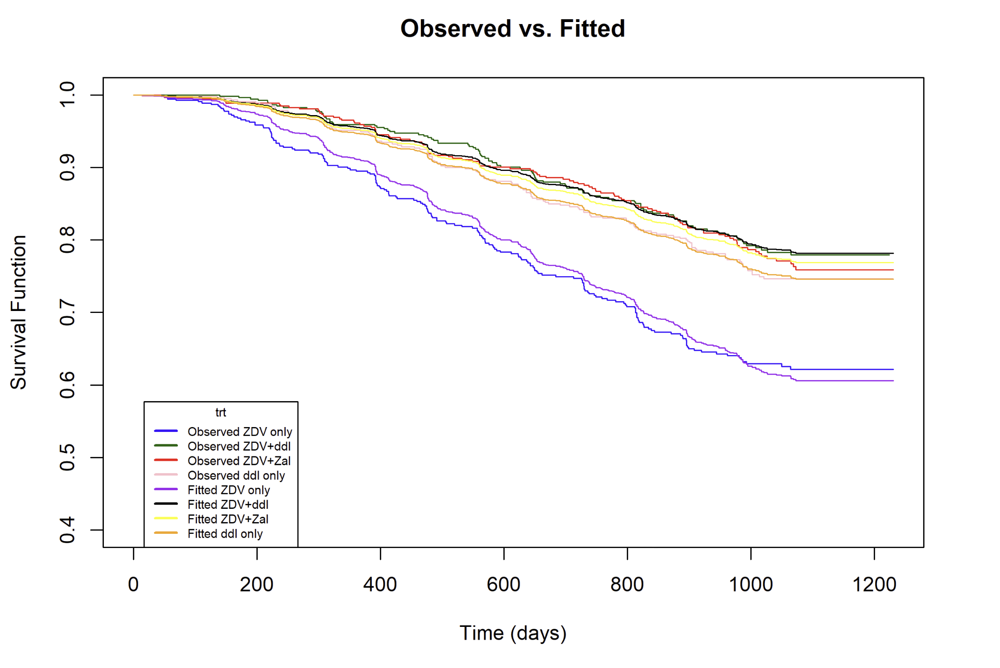

# Introduction
Acquired Immunodeficiency Syndrome (AIDS) remains a global health challenge affecting millions with HIV. The effectiveness of treatments is paramount for enhancing patient quality of life and survival. This report analyzed the AIDS Clinical Trials Group Study 175 dataset to assess diverse treatment efficacy.

# Methods
The exploratory data analysis (EDA) identified the baseline characteristics, categorizing variables into continuous and categorical types. Life tables provided interval-based survival summaries, while Kaplan-Meier curves, log-rank tests, and the Cox proportional hazards model assessed survival dynamics.


```{r setup, echo = FALSE, cache = FALSE, message = FALSE, warning=FALSE}
rm(list = ls())
library(tidyverse)
library(dplyr)
library(knitr)
library(kableExtra)
library(survival)
library(MASS)
library(ggfortify)
library(biostat3)
library(gridExtra)
## Global options
opts_chunk$set(echo      = TRUE,
	             cache     = TRUE,
               prompt    = FALSE,
               tidy      = FALSE,
               comment   = NA,
               message   = FALSE,
               warning   = FALSE,
               dpi       = 150,
               fig.width = 8, 
               fig.asp   = 5/7,
               fig.align = "center")
# attr.source = '.numberLines'
```


```{r}
# Read the data
# Construct tidied dataset
data <- read.csv("aids.csv") |> 
  mutate(
    trt = factor(recode(
      trt
      , '0' ="ZDV only"
      , '1' ="ZDV + ddI"
      , '2' ="ZDV + Zal"
      , '3' ="ddI only"
    ))
         )
```


\subsubsection{Kaplan-Meier estimator}
The Kaplan-Meier estimator is a non-parametric estimation of the survival function, S(t), which represents the probability of surviving past time t\cite{laj_2}. The Kaplan-Meier estimator for the survival function at time \( t \) is given by: \[ \hat{S}(t) = \prod_{i: t_i \leq t} \left(1 - \frac{d_i}{n_i}\right) \] where \( t_i \) are the distinct observed event times, \( d_i \) is the number of events at \( t_i \), and \( n_i \) is the number of individuals at risk just prior to \( t_i \). For each group, the Kaplan-Meier curve was plotted to illustrate the survival experience of participants over the study period. This method allowed us to utilize the full timeline of each participant, taking into account right-censoring, a common assumption where individuals' end of study data may not be due to the event of interest but rather due to loss of follow-up or study termination.


\subsubsection{Nelson-Aalen Estimator}

Similar to the Kaplan-Meier estimator, the Nelson-Aalen estimator is another non-parametric approach used in survival analysis. However, while the Kaplan-Meier estimator focuses on estimating the survival function, the Nelson-Aalen estimator is primarily used to estimate the cumulative hazard function, denoted as H(t). 

$$H(t)=\sum_{i:t_i\leq t}\frac{d_i}{n_i}$$

Hence,

$$\hat{S}(t) = \prod_{t_i\leq t} e^{-\frac{d_i}{n_i}}$$

This estimator accommodates right-censored data, making it valuable in studies with incomplete follow-ups.It is worth noting that the Nelson-Aalen estimator generally provides more conservative estimates of the cumulative hazard function compared to the Kaplan-Meier estimator.\cite{lzq_1}\cite{lzq_2}

```{r,fig.show='hide'}
km_fit <- survfit(Surv(time, cid) ~ trt, data)
km_plot = km_fit |> autoplot() +
  labs(x = "Time (Days)", y = "Estimated Survival Probability",
       title = "(a) Kaplan-Meier Survival Estimate") +
  theme_bw() 


data$trt <- factor(data$trt, labels = c("ZDV only", "ZDV + ddI", "ZDV + Zal", "ddI only"))
fh_fit <- survfit(Surv(time, cid) ~ trt, data, type = "fh")
fh_plot = fh_fit %>% autoplot() +
labs(x = "Time (Days)", y = "Estimated Survival Probability",
title = "(b) Nelson-Aalen Survival Estimate") + theme_bw()

grid.arrange(km_plot, fh_plot, ncol = 1)

```


## Create life-table stratified by trt


Life tables can provide interval-based summaries of survival data. For each treatment group, we calculated the number at risk, the number of events, and the proportion surviving at each interval. The hazard function was estimated as the ratio of the number of events to the number at risk in each interval. These estimates allowed us to observe the mortality rate's pattern over time and identify any periods with unusually high or low rates. Here, we just show one of the plot we made.

```{r}
lifetab_0 <- lifetab2(Surv(time, cid) ~ 1, data[data$trt == "ZDV only",], breaks = seq(0, 1300, by = 100))
# Show the life table information of different trt
kbl(lifetab_0, "simple", digits = 3)
```


### Plot the hazard ratio by trt based on life table estimate

```{r,fig.show='hide'}
# tx group 0
lifetab_0 %>%
mutate(time = tstart + (tstop - tstart)/2) %>%
ggplot(aes(x = time, y = hazard)) +
geom_point() + geom_line() + theme_bw() +
labs(x = "Time (Days)", y = "Hazard Rate",
title = "Hazard Function for Treatment Group 0 based on life-table estimate")
```


## Log rank score test

### Log rank score test of trt

This variable has four levels, and the test is performed across these four treatment groups.
The log-rank test results in a Chi-squared value of 49.2 with 3 degrees of freedom and a p-value of 1e-10. This is highly significant, indicating that there are significant differences in survival among the four treatment groups.
```{r}
# Ensure 'trt' is a factor
data$trt <- as.factor(data$trt)

# Create the survival object
surv_obj <- Surv(data$time, data$cid)

# Perform the log-rank test across multiple trt groups
log_rank_test_trt <- survdiff(surv_obj ~ trt, data = data)
```

### log rank score test of drugs

**p-value=0.06: **

In this case, with a p-value of 0.06, the result is not statistically significant at the 0.05 level, meaning there is not enough evidence to conclude that the survival experiences of the two groups (those with and without a history of intravenous drug use) are different. However, the p-value is close to the threshold, suggesting that there might be a trend worth exploring with a larger sample size or additional research.
```{r}
# Ensure 'drugs' is a factor if it's not already
data$drugs <- as.factor(data$drugs)

# Create the survival object
surv_obj <- Surv(data$time, data$cid)

# Perform the log-rank test
log_rank_test_drugs <- survdiff(surv_obj ~ drugs, data = data)
```


### log rank score test of genders

**p-value=0.09: **

In this case, with a p-value of 0.09, the result is not statistically significant at the 0.09 level, meaning there is not enough evidence to conclude that the survival experiences of male and female groups are different. However, the p-value is close to the threshold, suggesting that there might be a trend worth exploring with a larger sample size or additional research.
```{r}
# Ensure 'gender' is a factor if it's not already
data$gender <- as.factor(data$gender)

# Create the survival object
surv_obj <- Surv(data$time, data$cid)

# Perform the log-rank test
log_rank_test_gender <- survdiff(surv_obj ~ gender, data = data)
```

### log rank score test of homo

**p-value=0.06: **

In this case, with a p-value of 0.06, the result is not statistically significant at the 0.05 level, meaning there is not enough evidence to conclude that the survival experiences of the two groups (those with and without a history of intravenous drug use) are different. However, the p-value is close to the threshold, suggesting that there might be a trend worth exploring with a larger sample size or additional research.
```{r}
# Ensure 'homo' is a factor
data$homo <- as.factor(data$homo)

# Create the survival object
surv_obj <- Surv(data$time, data$cid)

# Perform the log-rank test
log_rank_test_homo <- survdiff(surv_obj ~ homo, data = data)
```


# Model selection with tests


```{r import data, echo = FALSE, cache = FALSE, message = FALSE,comment=NA}
aids<-read_csv("aids.csv")
n <- nrow(aids)
data<- aids |>
  janitor::clean_names()|>
  dplyr::select(time, cid, trt, everything())|>
  mutate_at(c(3), .funs = ~as.factor(.))

```


```{r}
fit1<-coxph(Surv(time, cid) ~ . , data = data)
stepwise1 <- stepAIC(fit1, direction = "both",trace = F) # BIC
stepwise1|>
  broom::tidy()|> 
  knitr::kable(digits = 3)
  
fit2 <- coxph(Surv(time,cid)~trt+preanti+karnof+age+drugs+symptom+offtrt+cd40+cd420+ cd820,data=data)

```


Our goal is to investigate the difference between two groups of different treatments, therefore we pre-specified to stratify by treatment in the model.


# Graphical Methods

Recall a PH model, $S(t|Z=z) = e^{-\int h_0(t)e^{\beta z}dt} = S_0(t)^{e^{\beta z}}$, by using a log-log transformation, i.e., $log\{-logS(t|Z=z)\}$, we have
$$log\{-log\hat{S}(t|Z=z)\}-log\{-log\hat{S_0}(t)\} = \beta $$ for indicator variable $Z$. This indicates two parallel lines under proportionality assumption.

```{r,fig.show='hide'}
library(ggfortify)
library(StepReg)
data_fit <- data |>
  dplyr::select(time, cid, trt, preanti, symptom, offtrt, cd420, cd820, karnof, age, drugs, cd40) |>
  mutate_at(c(3, 5, 6, 11), .funs = ~as.factor(.))


# --- treat ---
# km plot
fit_km_treat <- survfit(Surv(time, cid) ~ trt, data_fit)
autoplot(fit_km_treat) + theme_bw() +
  labs(x = "Time (days)", y = "Survival Function",
       title = "Kaplan-Meier Survival Estimate")
```


```{r,fig.show='hide'}
# loglog vs. log time
# png("ph_checking_1.png", width = 500, height = 400)
plot(fit_km_treat, fun = "cloglog", col = c("black", "red","pink","blue"),
     xlab = "Time (days in log scale)", ylab = "log{-log(S(t))}",
     main = "Log of Negative Log of Estimated Survival Functions")
legend("topleft", legend = c("ZDV only", "ZDV+ddl", "ZDV+Zal", "ddl only"), col = c("black", "red","pink","blue"), 
       lty = 1, cex = 1)
```


```{r,fig.show='hide'}
# observed vs. fitted
fit_ph_treat <- coxph(Surv(time, cid) ~ trt, data_fit)


# png("ph_checking_2.png", width = 500, height = 400)
plot(fit_km_treat, col = c("blue", "darkgreen", "red","pink"),
     xlab = "Time (days)", ylab = "Survival Function",
     ylim = c(0.4,1),
     main = "Observed vs. Fitted")
lines(survfit(fit_ph_treat, newdata = data.frame(trt = as.factor(0))), # 0
      col = "purple", conf.int = FALSE)
lines(survfit(fit_ph_treat, newdata = data.frame(trt = as.factor(1))), # 1
      col = "black", conf.int = FALSE)
lines(survfit(fit_ph_treat, newdata = data.frame(trt = as.factor(2))), # 2
      col = "yellow", conf.int = FALSE)
lines(survfit(fit_ph_treat, newdata = data.frame(trt = as.factor(3))), # 3
      col = "orange", conf.int = FALSE)
legend("bottomleft", legend = c("Observed ZDV only", "Observed ZDV+ddl",
                                "Observed ZDV+Zal", "Observed ddl only",
                                "Fitted ZDV only", "Fitted ZDV+ddl",
                                "Fitted ZDV+Zal", "Fitted ddl only"), 
       col = c("blue", "darkgreen", "red","pink",
               "purple", "black", "yellow", "orange"), lty = 1, cex = 0.6, lwd = 2,
       inset=c(0.05, 0), title="trt", xpd = TRUE)
```



**Interpretation:** The above two figures demonstrate the proportional hazards assumption is hold given there is only one indicator variable `trt` in the model.

*  The above methods work only for categorical variable, the slope in plots of residuals such as Schoenfeld vs. time can be used instead for continuous cases.


## Model checking II

But first, let's use the same covariates as above, plus the corresponding interaction terms s.t., **$covariate \times time$**. Results are shown as follows.

### Interaction test


```{r}
library(survminer)
# --- to be updated ---

data_fit <- data |>
  dplyr::select(time, cid, trt, preanti, symptom, offtrt, cd420, cd820, karnof, age, drugs, cd40) |>
  mutate_at(c(3, 5, 6, 11), .funs = ~as.factor(.))
```


```{r}
aids_fit <- coxph(Surv(time, cid == 1) ~ trt+ preanti+ symptom+ offtrt + cd420+ cd820 + karnof+ age+drugs+cd40, data_fit)

cox.zph(aids_fit)
```


```{r}
# interaction
aids_interaction_fit <- coxph(Surv(time, cid == 1) ~ trt+ preanti+ symptom+ offtrt + cd420+ cd820 + karnof+ age+drugs+cd40+tt(cd40)+ tt(cd420), data_fit, tt = function(x, t, ...) x*t)

summary(aids_interaction_fit)$coefficients |>
  kable("simple", 
        digits = 4, 
        escape = F, 
        booktabs = T, 
caption = "Regresion Coefficients Estimates of the Cox Model with Time Interactions") |>
  kable_styling(position = "center", 
                latex_options = "hold_position")
```

From the regression summary above, we can see that all the selected variable has a significant effect and interaction with time.

```{r, fig.show='hide'}
sjPlot::plot_models(aids_fit,aids_interaction_fit, show.values=T, grid=T, value.size = 2.5, m.labels = c("Original Cox", "Time-varying Cox"))
```


```{r, fig.show='hide'}
aids_fit<-coxph(Surv(time, cid) ~ ., data_fit)
# residual
ggcoxzph(cox.zph(aids_fit), var = c("cd420"), df = 2, nsmo = 1000)
```


```{r, fig.show='hide'}
ggcoxzph(cox.zph(aids_fit), var = c("cd40"), df = 2, nsmo = 1000)
```


From the above plot and the Schoenfeld individual test p-value, we can see that the residual plot has a non-zero slope regression line, and the p-value of the tests is less than 0.05, which means the covariate cd420 and cd40 don't meet the PH assumption.

```{r, fig.show='hide'}
# ggsave("ph_checking_4.png", width = 6, height = 4)
ggcoxzph(cox.zph(aids_fit), var = c("cd820"), df = 2, nsmo = 1000)
```


However, the covariate cd820 is different. 

Zero slop in the plot indicates :

1. PH model is valid

2. No time-varying $\beta_ j$


# Results
Life tables revealed diverse survival patterns, with ZDV-only Treatment exhibiting the earliest median survival time. Kaplan-Meier survival curved depicted survival probabilities for distinct treatment groups. Log-rank tests and trend log-rank tests assessed differences in survival experiences across groups. The Cox Proportional Hazard (PH) model was employed to predict survival times considering multiple covariates.


# Conclusion
This comprehensive analysis of the ACTG Study 175 dataset indicated AIDS patient survival dynamics and treatment efficacy. Further investigations into mechanistic insights and validation in broader contexts are essential for advancing HIV/AIDS treatment strategies.


